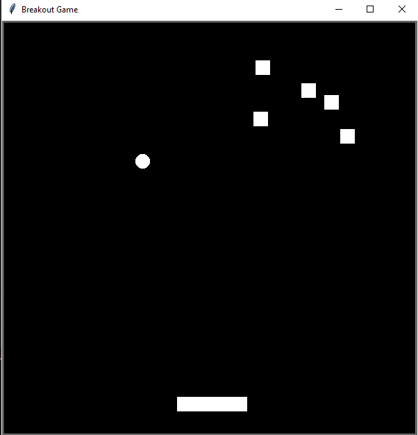

# Breakout Game



This is a simple Breakout game implemented in Python using the Turtle graphics library. The game involves a paddle, a bouncing ball, and bricks that the player needs to break.

## How to Play

1. **Set up the Screen:**
   - The game window is titled "Breakout Clone" with a black background.
   - The game area is a square of size 600x600 pixels.

2. **Paddle:**
   - A white paddle is controlled by the player at the bottom of the screen.
   - Move the paddle left and right using the Left and Right arrow keys, respectively.

3. **Ball:**
   - A white ball bounces around the game area.
   - The player's goal is to prevent the ball from falling off the bottom of the screen.

4. **Bricks:**
   - There are randomly positioned white bricks at the top of the screen.
   - The player needs to break these bricks by bouncing the ball into them using the paddle.

5. **Gameplay:**
   - The ball moves automatically, and the player controls the paddle to bounce the ball.
   - If the ball hits the walls, it will bounce back.
   - If the ball hits the paddle, it will bounce back up.
   - If the ball hits a brick, the brick disappears, and the ball changes direction.

6. **Scoring:**
   - The player scores by breaking the bricks.
   - The game does not currently display a score, but you can modify the code to add scoring features.

7. **Game Over:**
   - If the ball falls off the bottom of the screen, the game resets, and the player can continue playing.

## How to Run

Run the provided Python script `breakoutgame.py`. Make sure you have Python installed on your machine.

```bash
python breakoutgame.py
